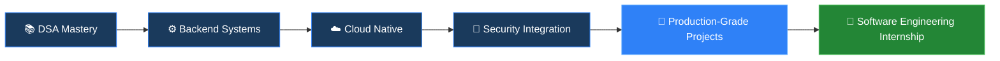

<div align="center">


<br/>

[](https://git.io/typing-svg)

<br/>

[](https://www.linkedin.com/in/muhammadalisheikhbd)
[](mailto:ali.sheikh.dev@gmail.com)
[](https://github.com/alisheikh55209-png)
[](https://github.com/alisheikh55209-png)

</div>

---

## `> whoami`

```yaml
name        : Muhammad Ali Sheikh
track       : Software Engineering
degree      : BS Information Engineering Technology
university  : University of Lahore, Pakistan
focus       : Backend Engineering · DSA · Cloud · AI · Secure Systems
philosophy  : "Build strong foundations before scaling complexity"
status      : Actively learning · Open to internships
```

> I write structured, maintainable, and scalable software — not surface-level implementations.  
> Every line of code I write is a deliberate engineering decision.

---

## `> tech --stack`

<div align="center">

### 🔷 Languages


### 🔷 Backend & Systems


### 🔷 Databases


### 🔷 Frontend


### 🔷 Cloud & DevOps (Learning Track)


### 🔷 Cyber Security


</div>

---

## `> academics --current-semester`

<table align="center">
  <tr>
    <td>

| Module | Area |
|---|---|
| 📊 Database Management Systems | Storage, Query Optimization |
| 🤖 Artificial Intelligence | ML Foundations, Search Algorithms |
| 📱 Mobile Application Development | Cross-Platform Systems |
| 🖥️ Advanced Frontend Development | Component Architecture |

  </td>
  <td>

| Module | Area |
|---|---|
| ⚙️ Advanced Backend Development | APIs, Server Design |
| ☁️ Cloud Computing | Distributed Architecture |
| 🔐 Cyber Security | Threat Modeling, Secure Design |
| 📝 Technical & Business Communication | Engineering Documentation |

  </td>
  </tr>
</table>

> These modules are shaping my understanding of **distributed systems, secure architecture, database design, and scalable application development**.

---

## `> principles --engineering`

```
01  Build strong foundations before scaling complexity
02  Prioritize correctness over speed
03  Engineer for maintainability, not cleverness
04  Learn deeply, not quickly
05  Think in systems, not scripts
06  Write code that the next engineer can trust
```

---

## `> stats --github`

<div align="center">


<br/><br/>

[](https://git.io/streak-stats)

<br/>

[](https://github.com/ryo-ma/github-profile-trophy)

<br/>

[](https://github.com/Ashutosh00710/github-readme-activity-graph)

</div>

---

## `> roadmap --2025`



---

## `> contact --open-to`

<div align="center">

| Opportunity | Status |
|---|:---:|
| 🔧 Software Engineering Internship | ✅ Open |
| ⚙️ Backend Development Roles | ✅ Open |
| ☁️ Cloud & AI Learning Collaborations | ✅ Open |
| 🔁 Open Source Contributions | ✅ Open |

**📬 ali.sheikh.dev@gmail.com**

</div>

---

<div align="center">


</div>
